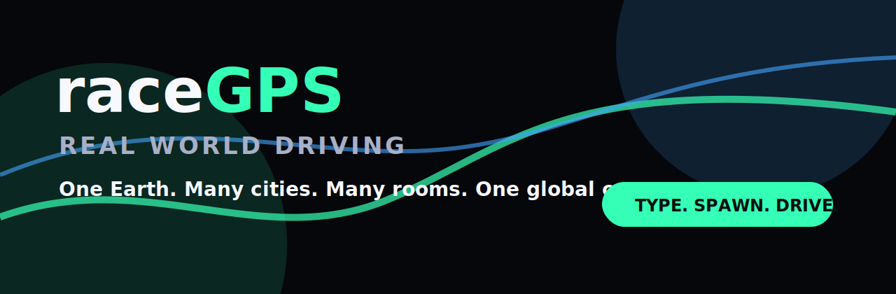

# raceGPS: Real World Driving

<p align="center">
  
</p>

**raceGPS** is a lightweight, modular multiplayer network for real-world arcade racing. Players spawn into cities, cruise mapped environments, chat in simple rooms, signal nearby drivers, race live or against ghosts, collect route objects, and play Cop-vs-Runner Hot Pursuit modes.

> **Core rule:** Cookies handle identity. WebSockets handle the world.

## Product Vision

**One Earth. Many cities. Many rooms. One player identity. One global career.**

raceGPS is designed as a web-first multiplayer layer that can sit on approved mapping/geospatial providers through adapter modules. The first implementation ships with a zero-key demo map shell so contributors can run it instantly. Future adapters can target MapLibre/OpenStreetMap-style stacks, Mapbox, Cesium, or an Unreal Engine premium client.

## Modes

- **Cruise Mode** — social free-roam room with simple chat, players, and challenge signals.
- **Race Mode** — lobby-based straight races, route races, live multiplayer, or AI/ghost opponents.
- **Challenge Mode** — collect route objects, hit checkpoints, beat timers, capture landmark tokens.
- **Hot Pursuit Mode** — role-based Cop vs Runner gameplay with heat, pickups, extraction, and tag/capture rules.
- **Explore Mode** — sightseeing, landmarks, tourist routes, natural features, stamps, and collectibles.

## MVP Loop

```text
Open raceGPS
  ↓
Choose a city or room
  ↓
Enter Cruise Mode
  ↓
See other drivers
  ↓
Chat or signal a challenge
  ↓
Start race / chase / challenge
  ↓
Finish, score, save ghost, share route
```

## Stack

```text
apps/web-client       Browser-first game client
apps/backend          Node/TypeScript API + WebSocket room server
packages/protocol     Shared realtime message schemas
packages/race-engine  Game-mode scoring, route, object, pursuit logic
packages/map-adapters Provider-agnostic map adapter interfaces
packages/ui-kit       Brand tokens and shared UI styling
assets/brand          Logo, icon, banner, social-card SVGs
docs                  Technical, marketing, safety, and launch docs
```

## Quick Start

```bash
npm install
npm run dev
```

The backend starts on `http://localhost:8787` and the web client starts on `http://localhost:5173`.

Open the web client, create a room, enter a display name, and connect. Use two browser tabs to simulate multiplayer.

## Repo Goals

- Open-source by default.
- Lightweight onboarding.
- Modular providers.
- WebSocket-first live rooms.
- Simple chat only.
- Strong arcade street-racing feel.
- Safety/compliance boundaries built into product design.
- Optional Unreal 5 / Cesium premium client later.

## What This Is Not

raceGPS is not a scraper, not a Google Maps clone, not a real-world reckless driving app, and not a real crime tutorial. It simulates fictional arcade racing, chase pressure, and route objectives over real-world-style map layers.

## License

Apache-2.0 for raceGPS code. Third-party SDKs, map providers, Unreal Engine, Cesium, tiles, datasets, fonts, and assets remain governed by their own terms.
