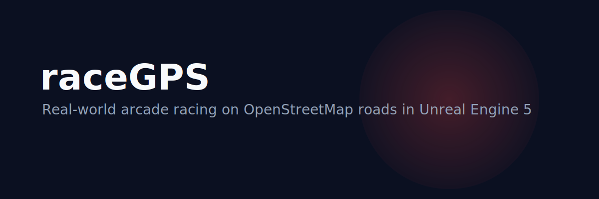

# raceGPS

<p align="center">
  
</p>

<p align="center">
  
</p>

<h3 align="center">Real-world arcade racing on OpenStreetMap roads in Unreal Engine 5</h3>

<p align="center">Race on actual city streets generated from OpenStreetMap and OpenDRIVE, powered by UE5 C++ and a Python semantic compiler.</p>

<p align="center">
  <a href="https://lumenhelixlab.github.io/raceGPS/">Launch Page</a>
  <span> · </span>
  <a href="https://github.com/lumenhelixlab/raceGPS">GitHub</a>
  <span> · </span>
  <a href="https://lumenhelix.com">LumenHelix</a>
</p>

---

raceGPS is an open-source desktop arcade racing game built on real-world map data. Instead of fictional tracks, you race on actual city streets rendered in 3D from OpenStreetMap and OpenDRIVE semantic road networks. The project combines a UE5.5 C++ gameplay stack with a pure-Python semantic compiler that fetches OSM data, generates valid OpenDRIVE 1.4 road networks, builds cruise sprint routes, and exports game-ready citypacks.

## Why raceGPS

- **Race the real world.** Every route is grounded in actual road geometry, not handcrafted fantasy tracks.
- **Own the pipeline.** Open-source UE5 C++ gameplay plus a Python semantic compiler you can extend for any city.
- **Build locally.** No required cloud service; compile the game, compiler, and installer on your own machine.

## Quick start

### macOS / Linux

```bash
git clone https://github.com/lumenhelixlab/raceGPS.git
cd raceGPS
# Prerequisites: UE 5.5, Xcode 15+, Python 3.10+
/Users/Shared/Epic Games/UE_5.5/Engine/Build/BatchFiles/Mac/GenerateProjectFiles.sh \
  -project="$(pwd)/apps/unreal-akron-beta/raceGPSAkronBeta.uproject" -game
cd apps/unreal-akron-beta
/Users/Shared/Epic Games/UE_5.5/Engine/Build/BatchFiles/Mac/Build.sh \
  raceGPSAkronBetaEditor Mac Development -project="$(pwd)/raceGPSAkronBeta.uproject"
cd ../../tools/akron-semantic-compiler
python3 -m venv ../../../.venv
source ../../../.venv/bin/activate
pip install -r requirements.txt
python compile_akron.py
```

### Windows (PowerShell)

```powershell
git clone https://github.com/lumenhelixlab/raceGPS.git
Set-Location raceGPS
# Prerequisites: UE 5.5, VS 2022 + C++ game workload, Python 3.10+
.\scripts\setup-ue5-dev-env.ps1
cd apps\unreal-akron-beta
.\Build.bat
cd ..\..\tools\akron-semantic-compiler
py -m venv ..\..\..\.venv
..\..\..\.venv\Scripts\pip install -r requirements.txt
py compile_akron.py
```

### Windows (Git Bash / WSL)

```bash
git clone https://github.com/lumenhelixlab/raceGPS.git
cd raceGPS
# Prerequisites: UE 5.5 Linux build, build-essential, clang, Python 3.10+
~/UnrealEngine/5.5/Engine/Build/BatchFiles/Linux/GenerateProjectFiles.sh \
  -project="$(pwd)/apps/unreal-akron-beta/raceGPSAkronBeta.uproject" -game
cd apps/unreal-akron-beta
~/UnrealEngine/5.5/Engine/Build/BatchFiles/Linux/Build.sh \
  raceGPSAkronBetaEditor Linux Development -project="$(pwd)/raceGPSAkronBeta.uproject"
cd ../../tools/akron-semantic-compiler
python3 -m venv ../../../.venv
source ../../../.venv/bin/activate
pip install -r requirements.txt
python compile_akron.py
```

> Tested on Windows 11, macOS Sonoma, Ubuntu 22.04/24.04, and modern mobile browsers.

## Features

| Feature | What it gives you |
|---------|-------------------|
| Real-world maps | Race on 1,370+ real Akron roads generated from OpenStreetMap and OpenDRIVE data. |
| Arcade physics | Chaos Vehicles tuned for drift-friendly, fun handling with ghost replay and leaderboards. |
| Cruise Sprint mode | Checkpoint-to-checkpoint racing with route ribbons, medals, and persistent achievements. |
| Cross-platform UE5 stack | C++ gameplay systems, Python semantic compiler, and build scripts for Windows, macOS, Linux, and WSL. |

## Architecture

```
OpenStreetMap data
        |
        v
Python semantic compiler  ->  OpenDRIVE 1.4 road network
        |
        v
citypacks/  ->  UE5.5 C++ gameplay  ->  Windows / macOS / Linux
```

## Development

```bash
# Build the UE5 editor (Windows PowerShell)
cd apps\unreal-akron-beta
.\Build.bat

# Or generate project files manually
"C:\Program Files\Epic Games\UE_5.5\Engine\Binaries\DotNET\UnrealBuildTool\UnrealBuildTool.exe" \
  -projectfiles -project="$(pwd)\raceGPSAkronBeta.uproject" -game -engine

# Run the semantic compiler
cd tools\akron-semantic-compiler
py compile_akron.py
```

## Roadmap

- [ ] Additional citypacks beyond Akron, Ohio
- [ ] Cross-platform CI build for Windows, macOS, and Linux
- [ ] Multiplayer lobby and online leaderboards

## License

Released under the MIT License. Map data © OpenStreetMap contributors.

---

<p align="center">
  <sub>raceGPS is a <a href="https://lumenhelix.com">LumenHelix</a> project — Applied Symbolic Dynamics & Reversible Computation.</sub>
</p>
