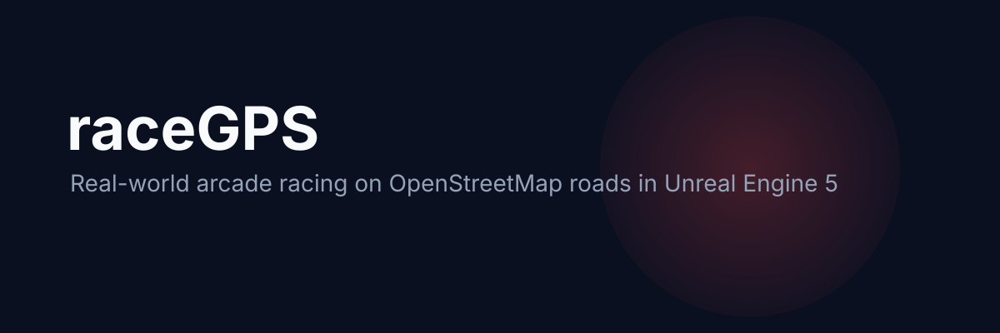

# raceGPS

<p align="center">
  
</p>

<p align="center">
  
</p>

<h3 align="center">Real-world arcade racing on OpenStreetMap roads in Unreal Engine 5</h3>

<p align="center">Race on actual city streets generated from OpenStreetMap and OpenDRIVE, powered by UE5 C++ and a Python semantic compiler.</p>

<p align="center">
  <a href="https://lumenhelixlab.github.io/raceGPS/">Launch Page</a>
  <span> · </span>
  <a href="https://github.com/LumenHelixLab/raceGPS">GitHub</a>
  <span> · </span>
  <a href="https://lumenhelix.com">LumenHelix</a>
</p>

[](https://www.unrealengine.com/)
[](LICENSE)
[]()

---

raceGPS is an open-source desktop arcade racing game built on real-world map data. Instead of fictional tracks, you race on actual city streets rendered in 3D from OpenStreetMap and OpenDRIVE semantic road networks. The project combines a UE5.7 C++ gameplay stack with a pure-Python semantic compiler that fetches OSM data, generates valid OpenDRIVE 1.4 road networks, builds cruise sprint routes, and exports game-ready citypacks.

## Why raceGPS

- **Race the real world.** Every route is grounded in actual road geometry, not handcrafted fantasy tracks.
- **Own the pipeline.** Open-source UE5 C++ gameplay plus a Python semantic compiler you can extend for any city.
- **Build locally.** No required cloud service; compile the game, compiler, and installer on your own machine.

## Quick start

### Current execution checkpoint

A packaged release has not been verified by the D1 audit. Source and map files
exist; passing portable tests does not establish Unreal compilation or playability.
See [D1 evidence and host handoff](docs/plans/D1_EXECUTION_REPORT.md) and
[the approved Cleveland production plan](docs/plans/2026-09-07-cleveland-production-v5.1.md).

### Portable checks (Python 3.12, Node 24 LTS)

```bash
python -m venv .venv
# Activate .venv using your shell, then:
python -m pip install -r requirements-dev.txt
python -m pytest tests -q
npm ci
npm run typecheck
npm run build
npm test
npm run dev
```

`npm run dev` starts the development backend. The desktop game runs in Unreal.
Backend lifecycle scripts build their local protocol/race-engine dependencies first.

### Windows Unreal build

Requires a local Unreal 5.7 installation, compatible VS C++ toolchain/Windows SDK,
and Python 3.11+ (3.12 is the tested orchestration runtime).

```powershell
python scripts/build.py --check --engine "C:\Program Files\Epic Games\UE_5.7"
python scripts/build.py --engine "C:\Program Files\Epic Games\UE_5.7" --config Development
```

`apps/unreal-akron-beta/Build.bat` delegates to this same runner. Each build uses
a fresh archive directory and retains commands, logs, engine metadata and hashes.
An explicit `--archive` must be empty. The result `packaged_not_play_tested` still
requires the editor, standalone and clean-machine gameplay acceptance checks.
Windows is the release target; Linux/Mac orchestration paths are not shipped-platform claims.

## Features

| Feature | What it gives you |
|---------|-------------------|
| Real-world maps | Race on 1,370+ real Akron roads generated from OpenStreetMap and OpenDRIVE data. |
| Arcade physics | Chaos Vehicles tuned for drift-friendly, fun handling with ghost replay and leaderboards. |
| Cruise Sprint mode | Checkpoint-to-checkpoint racing with route ribbons, medals, and persistent achievements. |
| Cross-platform UE5 stack | C++ gameplay systems, Python semantic compiler, and build scripts for Windows, Linux, and WSL. |

## Controls

| Action | Keyboard | Gamepad |
|--------|----------|---------|
| Throttle | W | RT |
| Brake / Reverse | S | LT |
| Steer Left | A | Left Stick Left |
| Steer Right | D | Left Stick Right |
| Handbrake | Space | A (Face Bottom) |
| Reset Vehicle | R | — |
| Toggle Camera | C | — |
| Pause | P / Esc | Menu |
| Developer Console | `~` (Tilde) | — |

## System Requirements

| Tier | Minimum | Recommended |
|------|---------|-------------|
| **OS** | Windows 10 64-bit | Windows 11 64-bit |
| **CPU** | Quad-core 2.5 GHz | 6-core 3.5 GHz |
| **RAM** | 8 GB | 16 GB |
| **GPU** | GTX 1060 / RX 580 | RTX 3060 / RX 6700 XT |
| **Storage** | 5 GB SSD | 5 GB NVMe SSD |
| **DirectX** | Version 12 | Version 12 |

## Architecture

```
OpenStreetMap data
        |
        v
Python semantic compiler  ->  OpenDRIVE 1.4 road network
        |
        v
citypacks/  ->  UE5.7 C++ gameplay  ->  Windows / Linux
```

## Project Structure

```
raceGPS
├── apps/unreal-akron-beta/     # UE5.7 C++ project (35+ classes)
│   ├── Source/                  # C++ gameplay, world, UI, systems
│   ├── Config/                  # Engine / Game / Input INIs
│   ├── Content/                 # Maps, materials, blueprints (Editor)
│   ├── citypacks/               # Generated city data
│   └── Build.bat                # Automated build script
├── tools/akron-semantic-compiler/  # Pure-Python OpenDRIVE generator
│   ├── compile_akron.py         # Main pipeline orchestrator
│   ├── osm_to_xodr.py           # OpenDRIVE XML writer
│   ├── route_generator.py       # Cruise sprint route builder
│   └── ...
├── docs/                        # Architecture & design docs
├── reference/web-renderer/      # Archived web renderer reference code
└── README.md                    # This file
```

## Development

```bash
# Type-check / lint (Python tools)
cd tools/akron-semantic-compiler
py -m compileall .

# Build the UE5 editor (Windows PowerShell)
cd apps/unreal-akron-beta
.\Build.bat
```

For architecture details, see [`docs/ARCHITECTURE.md`](docs/ARCHITECTURE.md).
For gameplay design, see [`docs/GAMEPLAY_DESIGN.md`](docs/GAMEPLAY_DESIGN.md).

## Roadmap

- [ ] Additional citypacks beyond Akron, Ohio (Cleveland in progress)
- [ ] Cross-platform CI build for Windows and Linux
- [ ] Multiplayer lobby and online leaderboards

## License

Source code is licensed under Apache-2.0; see [LICENSE](LICENSE). Map data © [OpenStreetMap](https://www.openstreetmap.org/copyright) contributors.

---

<p align="center">
  <sub>raceGPS is a <a href="https://lumenhelix.com">LumenHelix</a> project — Applied Symbolic Dynamics & Reversible Computation.</sub>
</p>
